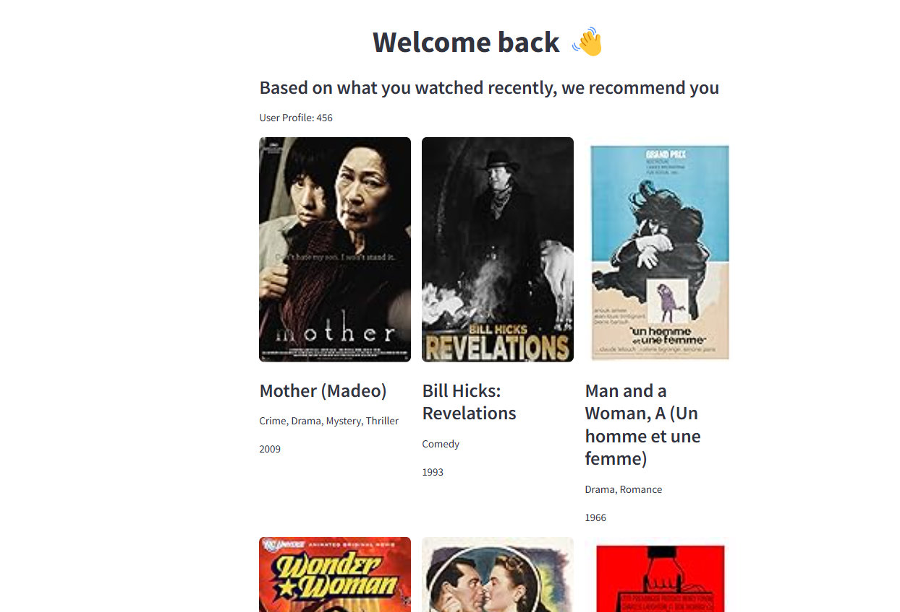

# NCF Recommendation System Project

## Overview
This project is a recommendation system designed to process and serve machine learning models efficiently. It is built using Python and leverages cloud technologies for scalable deployment.

The package allows the creation of a **Neural Collaborative Filtering (NCF)** recommender system with evaluation methods like **NDCG@K**. The model is packaged using **UV** and also includes the Python code for the frontend using **Streamlit**.

<p align="center">

</p>

## Project Structure
```
rec-sys
│── .github/                 # GitHub Actions or issue templates
│── docker/                  # Docker-related configurations
│── infra/                   # Infrastructure as Code (Terraform, Cloud setup)
│── src/                     # Source code of the recommendation system
│── vertex_features/         # Features related to GCP Vertex AI
│── .gitignore               # Git ignore file
│── .pre-commit-config.yaml  # Pre-commit hooks configuration
│── .python-version          # Python version management
│── example.env              # Environment variables example
│── pyproject.toml           # Python project configuration and dependencies
│── README.md                # Documentation (You are reading this)
│── uv.lock                  # Dependency lock file
```

## Installation
Ensure you have Python installed, then set up the environment:

```bash
uv sync 
```


## Usage
1. Set up environment variables using the provided `example.env` file.
2. Run the recommendation system:

```bash
rec-sys
```

## Model Deployment
The model is deployed to **GCP Vertex AI** following a structured process from the `vertex_features/` folder. 
- A **Dockerized environment** is used, where the package is installed in an image for training.
- The trained model is uploaded as a **MAR Archive** format to serve **TorchServe** while deploying.
- The **infra/** directory contains Terraform configurations for deployment.

## CI/CD Pipeline
This project includes a **CI/CD pipeline** that:
- Builds the package and uploads it to **Google Container Registry (GCR)**.
- Builds the image containing the package for deployment.

## Testing
Run unit tests:

```bash
uv run tests/
```

